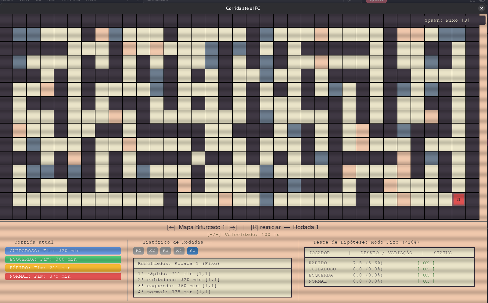

# Corrida até o IFC

Um jogo de labirinto feito em Python com Pygame. Quatro jogadores partem do mesmo mapa e cada um usa uma estratégia diferente de busca de caminho pra tentar chegar primeiro no destino. A ideia é comparar como cada abordagem se sai — em tempo, em consistência e em como reage a obstáculos no meio do caminho.

## Screenshot



Na imagem acima: o labirinto no topo, o placar da corrida atual à esquerda (com o tempo final de cada jogador), o histórico de rodadas no meio (abas `R1` a `R5`, cada uma guardando uma corrida anterior) e, à direita, o teste de hipótese mostrando o desvio e a variação de cada jogador no modo Fixo.

## Como rodar

```bash
pip install pygame sqlalchemy
python main.py
```

Na primeira execução o banco é criado e populado automaticamente com 6 mapas (bifurcados, livres e mistos).

## Controles

| Tecla | Ação |
|---|---|
| `←` / `→` | Navega entre os mapas |
| `R` | Reinicia a corrida no mesmo mapa, pra rodar de novo e comparar |
| `S` (ou clique no botão) | Alterna entre spawn Fixo (todos no mesmo ponto) e Aleatório |
| `+` / `-` | Acelera ou desacelera a simulação, sem precisar reiniciar o programa |

Quando todos os jogadores terminam, aparece o painel de Histórico embaixo. As abas `R1`, `R2`... guardam o resultado de cada rodada anterior, e ao lado fica o painel de estatística, que calcula desvio padrão e coeficiente de variação pra apontar se um jogador está tendo um desempenho consistente (variação abaixo de 10%) ou não.

## Os jogadores

Nenhum deles "pensa" de fato — são algoritmos de busca em grafo, cada um com uma regra fixa de decisão:

| Nome | Como decide o caminho |
|---|---|
| Normal | Busca em largura (BFS), explorando os vizinhos em ordem aleatória |
| Esquerda | Mesma busca em largura, mas sempre prioriza virar à esquerda primeiro (a clássica regra da mão na parede) |
| Rápido | Usa a mesma lógica do Normal, só que gasta menos tempo por célula percorrida |
| Cuidadoso | Busca com custo (parecido com Dijkstra) — prefere rodear obstáculos mesmo que o caminho fique mais longo |

Custo de tempo por célula percorrida:

| Valor na grade | Tipo de terreno | Custo (Normal / Rápido) |
|---|---|---|
| `0` ou `4` | Chão livre / destino | 5 / 2 |
| `2` | Obstáculo tipo A | 20 / 15 |
| `3` | Obstáculo tipo B | 15 / 10 |
| `1` | Parede | não pode passar |

## Os mapas

Gerados por um algoritmo de esculpir labirinto (backtracking recursivo), em três variações:

- Bifurcado: caminho principal mais cerca de 20% das paredes abertas, criando ciclos e rotas alternativas
- Livre: cerca de 40% das paredes abertas, quase um espaço aberto
- Misto: só o caminho base esculpido, sem abertura extra

## Estrutura do projeto

```
main.py               # loop do jogo, desenho na tela e input
classes/
├── Jogador.py         # as 4 estratégias de movimento
├── MapaModel.py       # carrega o mapa do banco e valida posições
├── GeradorMapas.py    # gera e popula os labirintos no banco
├── Historico.py       # salva/busca resultados e calcula estatísticas
└── Resultado.py       # estrutura simples de resultado por jogador
database/
├── config.py          # sessão e engine do SQLAlchemy
└── models_db.py       # modelos MapaModel / ResultadoModel
```

## Sobre o histórico

Cada corrida salva mapa, nome do jogador, tempo, posição de chegada, número da rodada, modo de spawn e ponto de partida. As estatísticas são calculadas separadamente por modo (Fixo x Aleatório), porque faz sentido comparar cada grupo dentro do próprio contexto — o spawn aleatório naturalmente tem mais variação que o fixo, então misturar os dois distorceria a análise.

Link vídeo no Youtube: https://youtu.be/7XD3Ojhqh7Ms